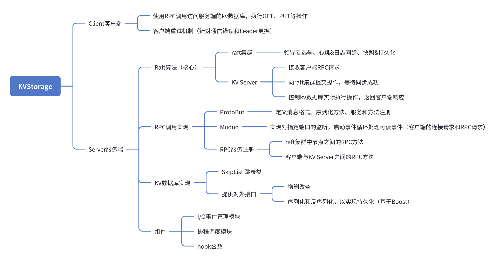

# KVStorageProjBaseRaft-cpp
## 介绍

此项目为简单的**基于Raft算法的K-V存储数据库**，使用C++代码完成。项目的功能模块如下图所示：

> 本项目的目的是学习Raft算法，并实现一个简单的k-v存储数据库。因此并不适用于生产环境

## 第三方库依赖

- muduo
- boost
- protoc

## 目录说明

- bin：生成的可执行文件存放地；
- doc：相关文档、知识点总结；
- example：示例代码存放地
- lib：编译后的库文件存放地；
- src：项目主要源码存放地，按照几个子模块分类；
- test：测试相关代码。

