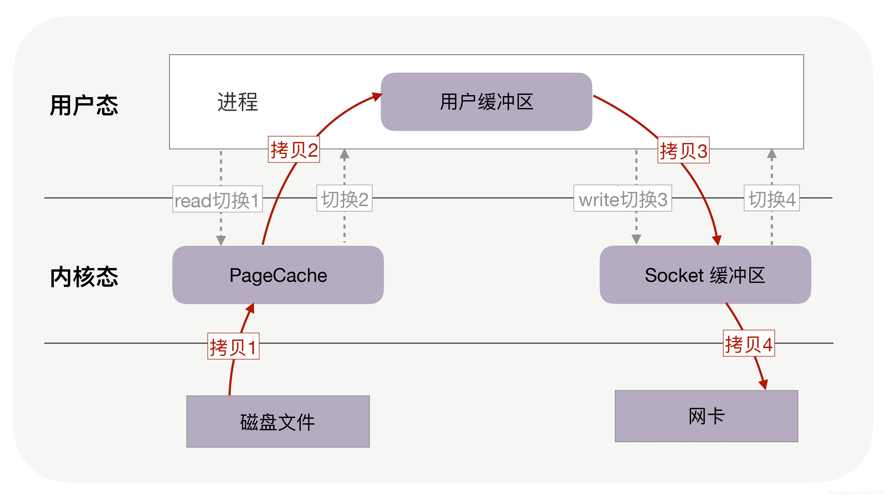

# Linux中的I/O多路复用

## 相关基础概念

在学习I/O多路复用之前，先学习一些相关的基础概念，便于理解。

### 内核缓冲区和用户缓冲区 😮

CPU 上会运行两种程序，一种是操作系统的内核程序（也称为系统程序），一种是应用程序。两者之间有控制和被控制的关系，前者有权管理和分配资源，而后者只能向系统申请使用资源。

显然，我们应该把在 CPU 上运行的这两类程序加以区分，这就是内核态和用户态出现的原因。

- **内核态（kernel mode）**：当 CPU 处于内核态势，这是操作系统管理程序（也就是内核）运行时所处的状态。运行在内核态的程序可以访问计算机的任何资源，不受限制，为所欲为，例如协调 CPU 资源，分配内存资源，提供稳定的环境供应用程序运行等。
- **用户态（user mode）**：应用程序基本都是运行在用户态的，或者说用户态就是提供应用程序运行的空间。运行在用户态的程序只能访问当前 CPU 上执行程序所在的地址空间，这样有效地防止了操作系统程序受到应用程序的侵害。

应用程序如果想要访问系统资源，可以通过**系统调用 or 中断（外中断、内中断）**从而使得 CPU 从用户态转向内核态。所谓系统调用，其实就是一些函数，操作系统直接提供了这些函数用于对文件和设备进行访问和控制。最常见的就是 read 和 write 。

根据内核态和用户态的定义，我们不难理解内核空间和用户空间的定义

- 用户操作系统内核能够访问的内存区域呢，就称为**内核空间（系统空间）**，它独立于普通的应用程序，是受保护的内存空间
- 而普通应用程序可访问的内存区域呢，就是**用户空间**


> **内核缓冲区**

一个应用程序从磁盘上读取文件时，通常分两步走：


但是访问磁盘的速度要远远低于访问内存的速度，完全不是一个量级的，所以理论上 read 磁盘的速度要远远慢于 read 内存。要解决这个问题，**内核缓冲区**（Kernel Buffer Cache）就应运而生了。内核缓冲区（准确的说，应该是**内核缓冲区缓存**），其实有两个作用，**缓冲(Buffer) + 缓存(Cache)**。

⭐ **数据预读**（作为Cache）

当程序发起 read() 系统调用时，<font color='red'>**内核会比请求更多地读取磁盘上的数据，保存在缓冲区，以备程序后续使用**</font>。这种数据的预取策略其实就是基于==**局部性原理**==。

因此当我们向内核请求读取数据时，内核会先到内核缓冲区中去寻找，如果命中数据，则不需要进行真正的磁盘 I/O，直接从缓冲区中返回数据就行了；如果缓存未命中，则内核会从磁盘中读取请求的 page，并同时读取紧随其后的几个 page（比如三个），如果文件是顺序访问的，那么下一个读取请求就会命中之前预读的缓存（当然了，预读算法非常复杂，这里只是一个简化的逻辑）。

⭐ **延时回写**（作为Buffer）

当程序发起 write() 系统调用时，**<font color='red'>内核并不会直接把数据写入到磁盘文件中，而仅仅是写入到缓冲区中</font>**，几秒后（或者说等数据堆积了一些后）才会真正将数据刷新到磁盘中。对于系统调用来说，数据写入缓冲区后，就返回了（不关注是否写真正写入到了磁盘，由操作系统自己绝决定）。

延迟往磁盘写入数据的最大一个好处就是，可以**合并更多的数据一次性写入磁盘，把小块的 I/O 变成大块 I/O，减少磁盘处理命令次数，从而提高提盘性能**。

另一个好处是，当**其它进程紧接着访问该文件时，内核可以从直接从缓冲区中提供更新的文件数据**（这里又是充当 Cache 了）。

> **用户缓冲区**

由于系统调用涉及到上下文切换，也会消耗资源，为了**减少系统调用的发生**呢（或者说，减少用户态和内核态的转换次数），就设计了**用户缓冲区**。

**<font color='cornflowerblue'>作用和内核缓冲区一样，数据阅读 + 延时回写，既充当 Cache 又充当 Buffer。</font>**

不同的就是，内核缓冲区处理的是内核空间和磁盘之间的数据传递，目的是减少访问磁盘的次数；而**<font color='red'>用户缓冲区处理的是用户空间和内核空间的数据传递，目的是减少系统调用的次数</font>**。


### 事件 ❓

- `可读事件`，当文件描述符关联的**内核读缓冲区可读**，则触发可读事件。(可读：内核缓冲区非空，有数据可以读取)
- `可写事件`，当文件描述符关联的**内核写缓冲区可写**，则触发可写事件。(可写：内核缓冲区不满，有空闲空间可以写入）

> 为什么文件描述符会和内核缓冲区关联？

文件描述符（File Descriptor）与内核缓冲区的关联是操作系统中处理文件和网络 I/O 时的一种机制。在操作系统中，每个打开的文件、设备或者网络连接都由一个唯一的文件描述符来标识。文件描述符是一个非负整数，由内核分配和管理。应用程序通过文件描述符来访问和操作文件、设备或者网络连接，比如读取、写入、关闭等操作。

内核（操作系统的核心部分）通过**内核缓冲区来管理文件和网络 I/O 的数据流**。每个文件描述符都会有关联的读缓冲区和写缓冲区。

- **读缓冲区**：用于存储<font color='cornflowerblue'>**从文件或网络**</font>接收的数据，等待应用程序读取。
- **写缓冲区**：用于存储应用程序写入但<font color='cornflowerblue'>**尚未发送到文件或网络**</font>的数据，等待操作系统将其发送出去。

因此，当应用程序打开一个文件、设备或者建立一个网络连接时，操作系统会为其分配一个文件描述符。同时，<font color='cornflowerblue'>**操作系统会为该文件描述符分配一定大小的读写缓冲区，这些缓冲区在内核空间中进行管理**</font>（因为需要和文件或网络打交道，即和磁盘或网卡等设备打交道）。文件描述符通过系统调用（如 `read()`、`write()`、`send()`、`recv()` 等）与对应的内核缓冲区进行数据交互。

### 服务器文件传输过程



若是服务器接收客户的请求，红色箭头方向相反。


### 内核接收网络数据全过程


1、计算机收到了对端传送的数据（步骤①）；

2、数据经由网卡传送到内存（步骤②）；

3、然后网卡通过中断信号通知cpu有数据到达，cpu执行中断程序（步骤③）。此处的中断程序主要有两项功能；

- 先将网络数据写入到对应socket的接收缓冲区里面（步骤④）；
- 再唤醒进程A（步骤⑤），重新将进程A放入工作队列中。

### **操作系统如何知道网络数据对应于哪个socket？**

因为一个socket对应着一个`端口号`，而网络数据包中包含了ip和端口的信息，内核可以通过端口号找到对应的socket。当然，为了提高处理速度，操作系统会维护端口号到socket的索引结构，以快速读取。

## 什么是I/O多路复用？

在文件I/O过程中，如果为每一个对文件描述符都分配一个独立的进程/线程去完成监听等工作，会导致高并发场景下出现大量的进程/线程，造成资源损耗。因此，I/O多路复用的思想是==**通过单个线程同时监控多个文件描述符（包括网络套接字、管道、文件等）进行I/O操作**==。

 **目标**：单个进程或线程中能够同时处理多个输入或输出

 **作用**：单个进程或线程可以同时监视多个**文件描述符**，避免了创建多个进程或线程的开销

 **方法：**通过系统调用（`select`、`poll`、`epoll`）实现

## 如何实现I/O多路复用？

> 1. select：最早的方法，遍历文件描述符集合
> 2. poll：为了克服select中的限制，建立一个动态文件描述符数组，用链表维护，从而突破了数量限制
> 3. epoll：Linux特有的，事件驱动

### ① select 😊

`select` 实现多路复用的方式是，将已连接的 Socket 都放到一个**文件描述符集合**（是一个BitsMap，位图），然后调用 `select` 函数将文件描述符集合**拷贝**到内核里，**让内核来检查是否有网络事件产生**，检查的方式很粗暴，就是通过**遍历文件描述符集合**的方式，当检查到有事件产生后，将此 Socket 标记为**可读或可写**， 接着再把整个文件描述符集合**拷贝**回用户态里，然后用户态还需要再通过**遍历**的方法找到可读或可写的 Socket，然后再对其处理。


对于 `select` 这种方式，需要进行<font color='red'> **2 次「遍历」**</font>文件描述符集合，一次是在内核态里，一个次是在用户态里 ，而且还会发生<font color='red'> **2 次「拷贝」**</font>文件描述符集合，先从用户空间传入内核空间，由内核修改后，再传出到用户空间中。

select 使用<font color='red'>**固定长度的 BitsMap，表示文件描述符集合**</font>，而且所支持的文件描述符的个数是有限制的，在 Linux 系统中，==**由内核中的 FD_SETSIZE 限制， 默认最大值为** **`1024`**，只能监听 0~1023 的文件描述符==。

### ② poll 😊

`poll`是对`select`的一种改进，两者本质是类似的。`poll` 不再用 BitsMap 来存储所关注的文件描述符，取而代之用**动态数组**，**以链表形式来组织**，**突破了 `select` 的文件描述符个数限制**，当然还会受到系统文件描述符限制。

`poll` 和 `select` 并没有太大的本质区别，都是使用**「线性结构」**存储进程关注的 Socket 集合，因此都<font color='red'>**需要遍历文件描述符集合**</font>来找到可读或可写的 Socket，时间复杂度为 O(n)，而且也**需要在用户态与内核态之间拷贝文件描述符集合**，这种方式**随着并发数上来，性能的损耗会呈指数级增长。**

### ③ epoll 😊

- **对文件描述符的管理：**

  **在内核里使用<font color='red'>红黑树</font>来跟踪进程所有待检测的文件描述字，**`select/poll`每次操作时都传入整个 集合给内核，而 `epoll` 因为在内核维护了红黑树，可以保存所有待检测的文件描述符 ，所以**只需要传入一个待检测的文件描述符**，减少了内核和用户空间大量的数据拷贝和内存分配。

- **获取就绪文件描述符**：

  使用<font color='red'>**事件驱动的机制**</font>，内核里维护了**一个链表来记录就绪事件**，当某个文件描述符有事件发生时，通过**回调函数**内核会将其加入到这个就绪事件列表中，当用户调用 `epoll_wait()` 函数时，**只会返回有事件发生的文件描述符的个数**，不需要像 select/poll 那样轮询扫描整个 socket 集合，大大提高了检测的效率。

  

## epoll详解

### epoll的简单用法

 **epoll的使用过程简单看就三步：**

  （1）调用epoll_create创建一个epoll句柄。

  （2）调用epoll_ctl, 将要监控的文件描述符进行注册。

  （3）调用epoll_wait, 等待文件描述符就绪。

```c
int s = socket(AF_INET, SOCK_STREAM, 0);
bind(s, ...);
listen(s, ...)

int epfd = epoll_create(...);
epoll_ctl(epfd, ...); //将所有需要监听的socket添加到epfd中

while(1) {
    int n = epoll_wait(...);	// 会阻塞等待
    for(接收到数据的socket){
        //处理
    }
}
```

### epoll_create：epoll文件描述符的创建

> 函数原型 ：int epoll_create(int size);
>
> 功能说明 ：创建一个 epoll 对象，返回该对象的描述符，注意要使用 close 关闭该描述符。
>
> 参数说明 ：从 Linux 内核 2.6.8 版本起，size 这个参数就被忽略了，只要求 size 大于 0 即可。
>
> 返回值：创建好的epoll文件描述符

 **epoll_create 创建一个 epoll 对象的时候究竟干了什么事情呢？**


如图，主要是创建了一个结构体<font color='red'>`eventpoll`</font>对象，然后对其成员进行初始化。`eventpoll`是`epoll`在内核中的数据结构，包含了 `epoll` 实现所需的各种数据结构和同步机制， 定义如下：

```c++
struct eventpoll
{
    spin_lock_t lock;            // 自旋锁，用于保护对该数据结构的访问，确保在多处理器环境下的并发安全
    struct mutex mtx;            // 互斥锁，用于防止在使用该结构体时被删除
    wait_queue_head_t wq;        // 等待队列头，用于在 sys_epoll_wait() 中使用的等待队列
    wait_queue_head_t poll_wait; // 等待队列头，用于在 file->poll() 中使用的等待队列
    struct list_head rdllist;    // 双向链表，存储已经满足条件的事件
    struct rb_root rbr;          // 红黑树的根节点，用于管理所有的文件描述符
    struct epitem *ovflist;      // 溢出列表，当事件太多无法立即处理时，临时存放事件的链表
};

/**
详细解释
spin_lock_t lock:
作用: 自旋锁，用于保护对 eventpoll 结构体的并发访问。自旋锁在多处理器环境下非常有用，因为它可以防止多个处理器同时访问和修改共享数据。
用途: 确保对 eventpoll 结构体的每次访问都是原子的，避免竞态条件。

struct mutex mtx:
作用: 互斥锁，用于防止在使用 eventpoll 结构体时该结构体被删除。
用途: 保证在 epoll 实例的生命周期内，不会因为并发操作导致结构体被意外删除

wait_queue_head_t wq:
作用: 等待队列头，用于 sys_epoll_wait() 函数的等待队列。
用途: 当 epoll_wait 调用时，如果没有事件发生，当前进程会被放入这个等待队列中休眠，直到有事件发生。

wait_queue_head_t poll_wait:
作用: 等待队列头，用于 file->poll() 函数的等待队列。
用途: 用于支持 epoll 对文件描述符的 poll 操作。当文件描述符上有事件发生时，唤醒等待队列中的进程。

struct list_head rdllist:
作用: 双向链表，存储已经满足条件的事件。
用途: 当文件描述符上的事件发生并满足条件时，将其加入到这个链表中，以便 epoll_wait 可以处理这些事件。

struct rb_root rbr:
作用: 红黑树的根节点，用于管理所有的文件描述符。
用途: epoll 使用红黑树来管理和查找所有被监控的文件描述符。红黑树具有高效的插入、删除和查找操作，适合用于大规模文件描述符的管理。

*struct epitem ovflist:
作用: 溢出列表，当事件太多无法立即处理时，临时存放事件的链表。
用途: 在某些情况下，如果事件的数量过多无法在一次 epoll_wait 调用中全部处理完，事件会被暂存到这个溢出列表中，以便下次处理。
**/
```


### epoll_ctl：事件注册函数

> 函数原型 ：int epoll_ctl(int epfd, int op, int fd, struct epoll_event *event);
>
> 功能说明 ：操作控制 epoll 对象，主要涉及 epoll 红黑树上节点的一些操作，比如添加节点，删除节点，修改节点事件。
>
> 参数说明：
>
> - epfd：通过 epoll_create 创建的 epoll 对象句柄。
>
> - op：对红黑树的操作，添加节点、删除节点、修改节点监听的事件，分别对应 EPOLL_CTL_ADD，EPOLL_CTL_DEL，EPOLL_CTL_MOD。
>   - 添加事件：相当于往红黑树添加一个节点，每个客户端连接服务器后会有一个通讯套接字，每个连接的通讯套接字都不重复，所以这个通讯套接字就是红黑树的 key。
>   - 修改事件：把红黑树上监听的 socket 对应的监听事件做修改。
>   - 删除事件：相当于取消监听 socket 的事件。
> - fd：需要添加监听的 socket 描述符，可以是监听套接字，也可以是与客户端通讯的通讯套接字。
>
> - event：事件信息。
>
> 返回值：事件注册结果

事件信息`event`为struct<font color='red'> `epoll_event`</font>对象，其定义如下： 

```cpp
typedef union epoll_data 
{
  void        *ptr;
  int          fd;
  uint32_t     u32;
  uint64_t     u64;
} epoll_data_t;
 
struct epoll_event 
{
  uint32_t     events;      /* Epoll 事件 */
  epoll_data_t data;        /* 用户数据 */
};
```

其中，成员 `events` 代表要监听的 epoll 事件类型，有**读事件，写事件**，类型为`uint32_t`。`data` 成员时一个联合体类型，它可以在我们调用 `epoll_ctl` 给 `fd` 添加/修改描述符监听的事件时顺带一些数据。

| events参数取值 | 含义                                                         |
| -------------- | ------------------------------------------------------------ |
| EPOLLIN        | 监听 fd 的读事件。举例：如果客户端发送消息过来，代表服务器收到了可读事件。 |
| EPOLLOUT       | 监听 fd 的写事件。如果 fd 对应的发数据内核缓冲区不为满，只要监听了写事件，就会触发可写事件。 |
| EPOLLRDHUP     | 监听套接字关闭或半关闭事件，Linux 内核 2.6.17 后可用。       |
| EPOLLPRI       | 监听紧急数据可读事件。                                       |

同时，事件创建后，**<font color='cornflowerblue'>内核会为这个文件描述符注册一个回调函数（其实是调用该文件描述符对应的内核对象的 `poll` 方法）</font>**。当事件触发时，内核会通过这个回调函数将其加入就绪事件列表。

### epoll_wait：等待事件发生

> 函数原型 ：int epoll_wait(int epid, struct epoll_event *events, int maxevents, int timeout);
>
> 功能说明 ：阻塞一段时间并等待事件发生，返回事件集合，也就是获取内核的事件通知。说白了就是遍历双向链表，把双向链表里的节点数据拷贝出来，拷贝完毕后就从双向链表移除。
>
> 参数说明
>
> - epid：epoll_create 返回的 epoll 对象描述符。
>
> - events：存放就绪的事件集合，这个是传出参数。
>
> - maxevents：代表可以存放的事件个数，也就是 events 数组的大小。
>
> - timeout：阻塞等待的时间长短，以毫秒为单位，如果传入 -1 代表阻塞等待。
>
> 返回值：
>
> | 返回值 | 含义                                |
> | ------ | ----------------------------------- |
> | >0     | 代表有几个我们希望监听的事件发生了  |
> | =0     | timeout 超时时间到了                |
> | <0     | 出错，可以通过 errno 值获取出错原因 |


### epoll文件描述符管理：红黑树

`epoll` 在内核里使用<font color='cornflowerblue'>**红黑树来跟踪进程所有待检测的文件描述符**</font>，把需要监控的 socket 通过 `epoll_ctl()` 函数加入内核中的红黑树里，红黑树是个高效的数据结构，增删改一般时间复杂度是 `O(logn)`。这样就不需要在每次操作时都传入整个文件描述符集合。

在红黑树中，保存事件的节点类型


### epoll事件驱动触发返回：双向链表

如上图所示，epoll**维护了一个<font color='cornflowerblue'>双向链表来记录就绪事件</font>**。当某个 socket 有事件发生时，通过**回调函数**内核会将其加入到这个就绪事件列表中。当用户调用 `epoll_wait()` 函数时，只会返回有事件发生的文件描述符的个数（如果有事件发生），若无事件发生则阻塞。在`epoll_wait()` 函数返回时，需要将存储就绪事件的双向链表从内核空间拷贝到用户空间，以提供给用户使用。

> 内核是如何拷贝事件结构到双向链表中的？

当某个文件描述符（如 socket）上的事件发生时，内核会通过**回调函数**将这个事件加入到 `epoll` 实例的就绪事件双向链表中。具体来说，回调函数会将事件对应的 `epitem` 结构体添加到 `eventpoll` 结构体的 `rdllist` 双向链表中。

> 双向链表如何从内核空间拷贝到用户空间？

用户在调用 `epoll_wait` 函数时，并提供一个 `struct epoll_event` 数组和其大小。内核会遍历 `rdllist` 双向链表，将每个就绪事件的信息拷贝到用户空间提供的 `struct epoll_event` 数组中（ `copy_to_user` 函数，更改页表）。

### epoll事件触发模式：边缘触发（ET）和水平触发（LT）

epoll 支持两种事件触发模式，分别是<font color='cornflowerblue'>**边缘触发（edge-triggered，ET）和水平触发（level-triggered，LT）**</font>。

> 情况一：水平触发模式

当被监控的 Socket 上有可读事件发生时，**服务器端不断地从 epoll_wait 中苏醒，直到内核缓冲区数据被 read 函数读完才结束**

- `socket`接收缓冲区`不为空` ，说明有数据可读， 读事件一直触发
- `socket`发送缓冲区`不满` ，说明可以继续写入数据 ，写事件一直触发

LT的处理过程：

1. `accept`一个连接，添加到`epoll`中监听`EPOLLIN事件` .（注意这里没有关注EPOLLOUT事件）
2. 当`EPOLLIN事件`到达时，`read fd`中的数据并处理 .
3. 当需要写出数据时，把数据`write到fd`中；如果数据较大，无法一次性写出，那么在`epoll`中监听`EPOLLOUT事件` .
4. 当`EPOLLOUT`事件到达时，继续把数据`write到fd`中；如果数据写出完毕，那么在`epoll`中关闭`EPOLLOUT事件`

```cpp
struct epoll_event event;
    struct epoll_event events[MAX_EVENTS];
    int epoll_fd = epoll_create1(0);
    
    // 打开文件并设置为非阻塞模式
    int fd = open("somefile", O_RDONLY | O_NONBLOCK);
    if (fd == -1) {
        perror("open");
        return 1;
    }

    event.data.fd = fd;
    event.events = EPOLLIN; // 使用 LT 模式监听读事件
    if (epoll_ctl(epoll_fd, EPOLL_CTL_ADD, fd, &event) == -1) {
        perror("epoll_ctl");
        close(fd);
        close(epoll_fd);
        return 1;
    }

    while (1) {
        int nfds = epoll_wait(epoll_fd, events, MAX_EVENTS, -1);
        if (nfds == -1) {
            perror("epoll_wait");
            break;
        }

        // 事件触发处理
        for (int i = 0; i < nfds; ++i) {
            if (events[i].events & EPOLLIN) {
                char buffer[READ_BUFFER_SIZE];
                ssize_t n = read(events[i].data.fd, buffer, sizeof(buffer));
                if (n == -1) {
                    perror("read");
                    close(events[i].data.fd);
                } else if (n == 0) {
                    // EOF
                    close(events[i].data.fd);
                } else {
                    // 处理读取的数据
                    process_data(buffer, n);
                }
            }
        }
```

> 情况二：边缘触发模式

仅在状态变化时触发事件，包括：

- `socket`的接收缓冲区状态变化时触发读事件，即**空的接收缓冲区刚接收到数据时触发读事件**（从无到有）
- `socket`的发送缓冲区状态变化时触发写事件，即**满的缓冲区刚空出空间时触发写事件**（从有到无）

ET的处理过程：

1. `accept`一个一个连接，添加到epoll中监听`EPOLLIN|EPOLLOUT`事件
2. 当`EPOLLIN事件`到达时，`read fd`中的数据并处理，`read`需要**一直读，直到返回`EAGAIN`为止**
3. 当`EPOLLOUT`事件到达时，继续把数据`write到fd`中，**直到数据全部写完，或者`write`返回`EAGAIN`**

**<font color='red'>总结：ET的要求是需要一直读写，直到返回EAGAIN，否则就会遗漏事件。</font>**

因此，当使用ET模式的epoll时，需要按照以下规则设计：

- 在接收一个I/O事件通知后，**立即处理该事件**。程序在某时刻应该**在相应的文件描述符上尽可能多地执行I/O**。

- 在ET模式下，在使用`epoll_ctl`注册文件描述符的事件时，应该把描述符设置为<font color='red'>`非阻塞的`（非常重要）</font>。

  *^因为程序采用循环来对文件描述符执行尽可能多的I/O，而文件描述符又被设置为可阻塞的，那么最终当没有更多的I/O可执行时，I/O系统调用就会阻塞。基于这个原因，每个被检查的文件描述符通常应该置为非阻塞模式，在得到I/O事件通知后重复执行I/O操作，直到相应的系统调用(比如read(),write())以错误码EAGAIN或EWOULDBLOCK的形式失败，而不是阻塞。^*

```cpp
struct epoll_event event;
struct epoll_event events[MAX_EVENTS];
int epoll_fd = epoll_create1(0);

// 将文件描述符设置为非阻塞模式
int fd = open("somefile", O_RDONLY | O_NONBLOCK);

event.data.fd = fd;
event.events = EPOLLIN | EPOLLET; // 监听读事件，并使用 ET 模式
epoll_ctl(epoll_fd, EPOLL_CTL_ADD, fd, &event);

while (1) {
    int nfds = epoll_wait(epoll_fd, events, MAX_EVENTS, -1);
    // 事件触发
    for (int i = 0; i < nfds; ++i) {
        if (events[i].events & EPOLLIN) {
            // 循环读取，直到返回 EAGAIN
            while (1) {
                char buffer[READ_BUFFER_SIZE];
                ssize_t n = read(events[i].data.fd, buffer, sizeof(buffer));
                if (n == -1) {
                    if (errno == EAGAIN) {
                        // 没有更多数据可读
                        break;
                    } else {
                        // 读取出错
                        perror("read");
                        close(events[i].data.fd);
                        break;
                    }
                } else if (n == 0) {
                    // EOF
                    close(events[i].data.fd);
                    break;
                } else {
                    // 处理读取的数据
                    process_data(buffer, n);
                }
            }
        }
    }
}

```

> 总结

- 使用水平触发模式时，当被监控的 Socket 上有可读事件发生时，**服务器端不断地从 epoll_wait 中苏醒，直到内核缓冲区数据被 read 函数读完才结束**，目的是告诉我们有数据需要读取；
- 使用边缘触发模式时，当被监控的 Socket 描述符上有可读事件发生时，**服务器端只会从 epoll_wait 中苏醒一次**，即使进程没有调用 read 函数从内核读取数据，也依然只苏醒一次，因此我们程序要保证一次性将内核缓冲区的数据读取完；

一般来说，边缘触发的效率比水平触发的效率要高，因为边缘触发可以减少 `epoll_wait` 的系统调用次数，系统调用也是有一定的开销的的，毕竟也存在上下文的切换。

`select/poll` 只有水平触发模式，`epoll` 默认的触发模式是水平触发，但是可以根据应用场景设置为边缘触发模式。

## 相关面试问题

### 1. Linux epoll ET模式下 EPOLLOUT和EPOLLIN触发场景？

> **EPOLLIN事件**

- **初次注册（连接）时如果可读：**当文件描述符初次注册到 `epoll` 时，如果此时读缓冲区是非空的，则会立即触发 `EPOLLIN` 事件。
- **文件描述符的读缓冲区从空变为非空：**只有当读缓冲区从空变为非空时才会触发 `EPOLLIN` 事件（仅会触发状态变化的这一次）。
- **错误条件（EPOLLERR 和 EPOLLHUP）**：文件描述符发生错误或挂起，也会触发 `EPOLLIN` 事件，并同时设置相应的错误标志（`EPOLLERR` 或 `EPOLLHUP`）。以通知应用程序文件描述符的状态发生了变化，需要进行相应的处理

> **EPOLLOUT事件**

- **初次注册（连接）时如果可写**：当文件描述符初次注册到 `epoll` 时，如果此时写缓冲区是空闲的，则会立即触发 `EPOLLOUT` 事件。
- **文件描述符从不可写变为可写**：当文件描述符的写缓冲区从满状态变为空闲状态时（先写满了导致返回`EAGAIN`错误，然后读端读取了部分数据，使得写缓冲区又获得了一些空间可写），此时会触发 `EPOLLOUT` 事件。

### 2. epoll为什么高效？

主要原因：

1. 维护了红黑树来存储文件描述符，不需要每次将所有文件描述符在内核空间和用户空间之间拷贝

     		2. 采用回调函数的方式检测就绪事件，而不是轮询，避免了对整个文件描述符的遍历
     		3. 文件描述符数量无上限（取决于系统内存）

| 系统调用                               | select                                                       | poll                                                         | epoll                                                        |
| -------------------------------------- | ------------------------------------------------------------ | ------------------------------------------------------------ | ------------------------------------------------------------ |
| 事件集合                               | 用户通过3个参数分别传入感兴趣的可读，可写及异常等事件内核通过对这些参数的在线修改来反馈其中的就绪事件，这使得用户每次调用select都要重置这3个参数 | 统一处理所有事件类型，因此只需要一个事件集参数。用户通过pollfd.events传入感兴趣的事件，内核通过修改pollfd.revents反馈其中就绪的事件 | 内核通过一个事件表直接管理用户感兴趣的所有事件。因此每次调用epoll_wait时，无需反复传入用户感兴趣的事件。epoll_wait系统调用的参数events仅用来反馈就绪的事件 |
| 应用程序索引就绪文件描述符的时间复杂度 | O(n)                                                         | O(n)                                                         | O(1)，因为epoll_wait只返回就绪的事件列表，不需要再遍历了     |
| 最大支持文件描述符数                   | 一般有最大值限制1024（32位机器，32 * 32,64位机器 32 * 64）   | 无限制                                                       | 无限制（1GB内存的机器上大约是10万左右，这个数目和系统内存关系很大，<font color='red'>面试问过</font> |
| 工作模式                               | LT                                                           | LT                                                           | LT、ET                                                       |
| 内核实现和工作效率                     | 采用轮询方式检测就绪事件，时间复杂度：O(n)                   | 采用轮询方式检测就绪事件，时间复杂度：O(n)                   | 采用回调方式检测就绪事件，时间复杂度：O(1)<br />文件描述符的增删改查，涉及到红黑树，时间复杂度为O(log n) |
| 消息传递方式                           | 内核需要将消息传递到用户空间，都需要内核拷贝动作             | 内核需要将消息传递到用户空间，都需要内核拷贝动作             | 其实并没有共享内存，也需要拷贝，但只需要拷贝就绪的事件文件描述符 |

`epoll` 在处理大量文件描述符时具有显著的性能优势，尤其是在大量文件描述符，但是触发的不多（远小于总量）。

### 3. epoll的潜在问题

**最主要、最核心的问题**：如果在使用 `epoll` 的程序中，所有事件的处理都在一个单独的线程中进行。当存在就绪事件时，epoll_wait函数返回后，如果就绪事件过多，线程会一直在处理当前就绪事件，而无法去兼顾新增的就绪事件。

**解决方案**：多进程或多线程优化。**<font color='cornflowerblue'>（其实这不能说是epoll的问题，单线程都会存在这种问题）</font>**

### 4. 场景题：在某一时刻，有多个连接同时到达，服务器的 TCP 就绪队列瞬间积累多个就绪连接，由于是边缘触发模式，epoll 只会通知一次，accept 只处理一个连接，导致 TCP 就绪队列中剩下的连接都得不到处理。在这种情形下，我们应该如何有效的处理呢？

**解决方案：**

首先，将套接字设置非阻塞模式，可以是`accept` 函数在没有新连接时能够立即返回错误码 `EAGAIN`。

然后，用 while 循环抱住 accept 调用，处理完 TCP 就绪队列中的所有连接后再退出循环。（这也是ET模式下的常用处理操作，把所有的IO操作等都做完）

**如何知道是否处理完就绪队列中的所有连接呢？**

 accept 返回 -1 并且 errno 设置为 EAGAIN 就表示所有连接都处理完。

## 参考文献

以上内容多摘抄于以下博客，若有侵权，请告知删除：

[一文搞懂用户缓冲区与内核缓冲区-CSDN博客](https://blog.csdn.net/Jiangtagong/article/details/108703123)

[虎牙一面：请详细介绍一下内核缓冲区-CSDN博客](https://blog.csdn.net/m110572/article/details/125236240)

[epoll函数原理和使用介绍-CSDN博客](https://blog.csdn.net/weixin_38102771/article/details/93885126)

[详解IO多路复用机制——select、poll、epoll的原理和区别_select poll epoll原理和区别-CSDN博客](https://blog.csdn.net/adminpd/article/details/124553590)

[Linux下的I/O复用技术 — epoll如何使用（epoll_create、epoll_ctl、epoll_wait） 以及 LT/ET 使用过程解析_主动去触发epoll事件-CSDN博客](https://blog.csdn.net/JMW1407/article/details/107963618)

[Epoll常见面试问题，LT和ET区别？将socket设为非阻塞？正确的读写方式？关于epoll的数据结构？epoll与select、poll的对比？_epoll面试题-CSDN博客](https://blog.csdn.net/JMW1407/article/details/107986219)
