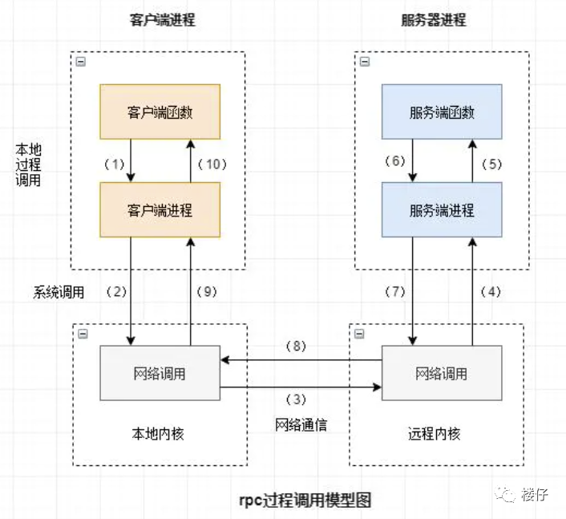
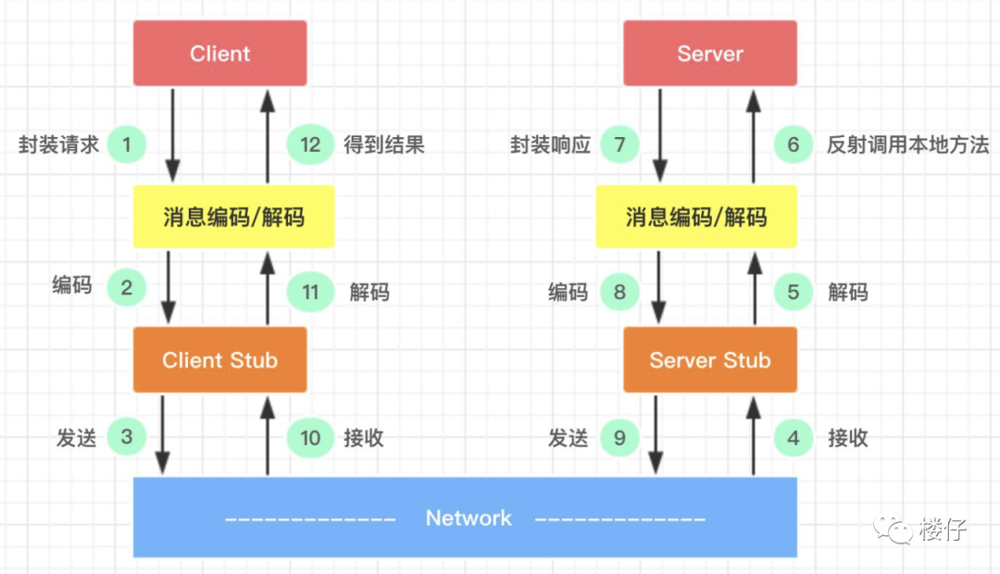
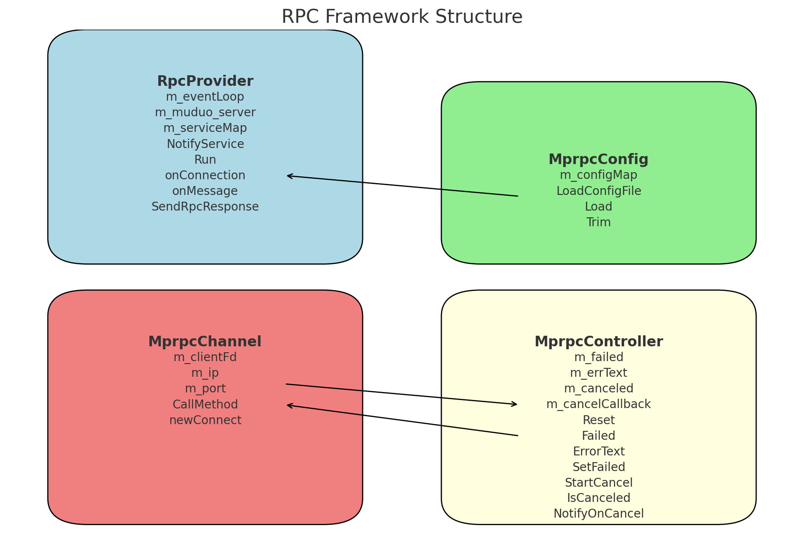

# 远程过程调用协议 RPC

## 什么是RPC？

RPC（Remote Procedure Call Protocol）远程过程调用协议。一个通俗的描述是：**客户端在不知道调用细节的情况下，调用存在于远程计算机上的某个对象，就像调用本地应用程序中的对象一样**。

正式描述：**一种通过网络从远程计算机程序上请求服务，而不需要了解底层网络技术的协议**。

几个要点：

- **RPC是协议：**既然是协议就只是一套规范，那么就需要有人遵循这套规范来进行实现。目前典型的RPC实现包括：Dubbo、Thrift、GRPC、Hetty等。
- **网络协议和网络IO模型对其透明**：既然RPC的客户端认为自己是在调用本地对象。那么传输层使用的是TCP/UDP还是HTTP协议，又或者是一些其他的网络协议它就不需要关心了。
- **信息格式对其透明**：我们知道在本地应用程序中，对于某个对象的调用需要传递一些参数，并且会返回一个调用结果。至于被调用的对象内部是如何使用这些参数，并计算出处理结果的，调用方是不需要关心的。那么对于远程调用来说，这些参数会以某种信息格式传递给网络上的另外一台计算机，这个信息格式是怎样构成的，调用方是不需要关心的。
- **应该有跨语言能力**：调用方实际上也不清楚远程服务器的应用程序是使用什么语言运行的。那么对于调用方来说，无论服务器方使用的是什么语言，本次调用都应该成功，并且返回值也应该按照调用方程序语言所能理解的形式进行描述。



## 为什么要用RPC？

应用开发到一定的阶段的强烈需求驱动的。如果我们开发简单的单一应用，逻辑简单、用户不多、流量不大，那我们用不着。当我们的系统访问量增大、业务增多时，我们会发现一台单机运行此系统已经无法承受。此时，我们可以将业务拆分成几个互不关联的应用，分别部署在各自机器上，以划清逻辑并减小压力。此时，我们也可以不需要RPC，因为应用之间是互不关联的。

当我们的业务越来越多、应用也越来越多时，自然的，我们会发现有些功能已经不能简单划分开来或者划分不出来。此时，**可以将公共业务逻辑抽离出来，将之组成独立的服务Service应用 。而原有的、新增的应用都可以与那些独立的Service应用交互，以此来完成完整的业务功能**。

所以此时，我们急需**一种高效的应用程序之间的通讯手段来**完成这种需求，所以你看，RPC大显身手的时候来了！

其实描述的场景也是**服务化 、微服务和分布式系统架构**的基础场景。即RPC框架就是实现以上结构的有力方式。

> **一些常用的RPC框架：**
>
> - **Thrift：**thrift是一个软件框架，用来进行可扩展且跨语言的服务的开发。它结合了功能强大的软件堆栈和代码生成引擎，以构建在 C++, Java, Python, PHP, Ruby, Erlang, Perl, Haskell, C#, Cocoa, JavaScript, Node.js, Smalltalk, and OCaml 这些编程语言间无缝结合的、高效的服务。
> - **gRPC：**一开始由 google 开发，是一款语言中立、平台中立、开源的远程过程调用(RPC)系统。
> - **Dubbo：**Dubbo是一个分布式服务框架，以及SOA治理方案。其功能主要包括：高性能NIO通讯及多协议集成，服务动态寻址与路由，软[负载均衡](https://cloud.tencent.com/product/clb?from_column=20065&from=20065)与容错，依赖分析与降级等。Dubbo是阿里巴巴内部的SOA服务化治理方案的核心框架，Dubbo自2011年开源后，已被许多非阿里系公司使用。
> - **Spring Cloud：**Spring Cloud由众多子项目组成，如Spring Cloud Config、Spring Cloud Netflix、Spring Cloud Consul 等，提供了搭建分布式系统及微服务常用的工具，如配置管理、服务发现、断路器、智能路由、微代理、控制总线、一次性token、全局锁、选主、分布式会话和集群状态等，满足了构建微服务所需的所有解决方案。Spring Cloud基于Spring Boot, 使得开发部署极其简单。

## RPC的原理

**一个RPC调用的流程涉及到的通信细节：**

1. 服务消费方（client）调用以本地调用方式调用服务；
2. client stub接收到调用后负责将方法、参数等组装成能够进行网络传输的消息体；
3. client stub找到服务地址，并将消息发送到服务端；
4. server stub收到消息后进行解码；
5. server stub根据解码结果调用本地的服务；
6. 本地服务执行并将结果返回给server stub；
7. server stub将返回结果打包成消息并发送至消费方；
8. client stub接收到消息，并进行解码；
9. 服务消费方得到最终结果。



RPC的目标就是要**2~8这些步骤都封装起来，让用户对这些细节透明**。


# 基于Protobuf的简易RPC框架实现

## 什么是Protobuf？

Protobuf（[Protocol](https://so.csdn.net/so/search?q=Protocol&spm=1001.2101.3001.7020) Buffers）协议是一种由 Google 开发的`高效的`、`跨语言的`、`平台无关`的**数据序列化协议**，提供二进制序列化格式和相关的技术，它用于**高效地序列化和反序列化结构化数据**，通常用于网络通信、数据存储等场景。

Protobuf 在许多领域都得到了广泛应用，特别是在**分布式系统、RPC（Remote Procedure Call）框架和数据存储**中，它提供了一种高效、简洁和可扩展的方式来序列化和交换数据，Protobuf 的主要优点包括：

- **高效性**：Protobuf 序列化后的二进制数据通常比其他序列化格式（比如超级常用的JSON）更小，并且序列化和反序列化的速度更快，这对于性能敏感的应用非常有益。
- **简洁性**：Protobuf 使用一种定义消息格式的语法，它允许定义字段类型、顺序和规则（消息结构更加清晰和简洁）
- **版本兼容性**：Protobuf 支持向前和向后兼容的版本控制，使得在消息格式发生变化时可以更容易地处理不同版本的通信。
- **语言无关性**：Protobuf 定义的消息格式可以在多种编程语言中使用，这有助于跨语言的通信和数据交换（截至本文发布目前官方支持的有C++/C#/Dart/Go/Java/Kotlin/python）
- **自动生成代码**：Protobuf 通常与相应的工具一起使用，可以自动生成代码，包括序列化/反序列化代码和相关的类（减少了手动编写代码的工作量，提高效率）

> 参考博客：[【保姆级】Protobuf详解及入门指南-CSDN博客](https://blog.csdn.net/aqin1012/article/details/136628117)

## 一些基础概念

**服务（service）：**在RPC框架中，服务是一组方法的集合，这些方法可以被远程调用。

**服务对象（Service Object）**: 一个服务对象通常代表某个特定的业务逻辑或功能模块，例如用户管理服务、订单处理服务等。本项目中，服务对象是从`google::protobuf::Service`类派生而来的。每个服务对象包含一组可以远程调用的方法（RPC方法）。

**方法描述符（Method Descriptor）**：`google::protobuf::MethodDescriptor`是一个描述单个RPC方法结构的对象，它包含方法的名称、输入参数类型、输出参数类型等信息。

## 简易RPC框架的实现

### 整体框架

基于muduo网络库和protobuf实现了一个同步阻塞的简易RPC框架，在该框架中一共封装了四个主要的类模块，包括：**RpcProvider、MprpcController、MprpcConfig、MprpcChannel**，它们具体作用为：

- `RpcProvider`：负责在服务端注册RPC服务，并启动RPC服务节点，提供RPC远程网络调用服务
- `MprpcController`：用于在RPC调用过程中，控制执行流程、处理错误以及取消调用
- `MprpcChannel`：负责将客户端的RPC方法调用转换成网络请求，发送到服务器，并接收响应
- `MprpcConfig`：解析和加载配置文件，提供配置信息供其他模块使用



让我们详细来拆解每个模块。

### RpcProvider：服务端

**职责**：作为服务端，负责注册服务和处理来自客户端的请求。它提供外部接口以便**注册服务**，并启动 **RPC 服务节点来监听和处理客户端的请求**。

在项目中，该类的结构如下：

```cpp
+---------------------+     
|     RpcProvider     | 
|---------------------| 
| - m_eventLoop       |		// Muduo网络库提供的EventLoop对象，事件循环，管理事件和调度回调函数
| - m_muduo_server    |   	// Muduo网络库提供的TcpServer对象，实现高并发的 TCP 连接管理
| - m_serviceMap      | 	// 哈希表存储注册成功的服务信息，键为服务名，值为ServiceInfo对象
|---------------------|
| + NotifyService     | 	// 注册一个RPC服务，将服务实例注册到RPC框架中，使这个服务可以被远程调用
| + Run               | 	// 启动 RPC 服务节点，开始提供 RPC 远程网络调用服务
| - onConnection      | 	// 处理新 socket 连接的回调函数
| - onMessage         |		// 接收来自客户端的消息，调用相应的方法处理请求
| - SendRpcResponse   |		// 发送RPC方法调用的响应给客户端
+---------------------+
```

其中，`ServiceInfo`结构体如下：

```cpp
struct ServiceInfo {
    google::protobuf::Service *m_service;		// 指向服务对象的指针
    std::unordered_map<std::string, const google::protobuf::MethodDescriptor*> m_methodMap;	// 服务方法的映射，键为方法名，值为方法描述符的指针
};
```

`RpcProvider` 类是整个 RPC 框架的核心部分，主要负责**服务的注册和管理、处理客户端请求、发送响应**。通过与 Muduo 网络库的结合，实现了高效的网络通信和事件处理。`RpcProvider` 类使得 RPC 服务端能够快速地响应客户端的远程调用请求，从而实现分布式系统中的高效服务交互。

> **服务的注册与管理**

在本RPC框架中，服务对象被统一地管理在了哈希表`m_serviceMap`中，键为服务的名称，值为`ServiceInfo`对象（保存了跟服务对象相关的内容）。注册服务的过程实质上就是在`m_serviceMap`增加新的元素的过程：

```cpp
/*
NotifyService 方法
目的：注册服务及其方法
步骤：
    1. 获取服务的描述信息
    2. 获取服务的名称和方法的数量
    3. 遍历方法，将每个方法的描述信息保存到‘service_info'的'm_methodMap'中
    4. 将服务对象保存到'service_info'中，并将'service_info'添加到'm_serviceMap'中
*/
void RpcProvider::NotifyService(google::protobuf::Service *service) {
    ServiceInfo service_info;

    // 获取服务对象描述信息
    const google::protobuf::ServiceDescriptor *pserviceDesc = service->GetDescriptor();

    // 获取服务对象的名称和方法数量
    std::string service_name = pserviceDesc->name();
    int methodCnt = pserviceDesc->method_count();

    // 保存每个方法信息
    for (int i = 0; i < methodCnt; i++){
        const google::protobuf::MethodDescriptor *pmethodDesc = pserviceDesc->method(i);
        std::string method_name = pmethodDesc->name();
        service_info.m_methodMap.insert(std::pair(method_name, pmethodDesc));
    }

    // 保存服务对象
    service_info.m_service = service;
    m_serviceMap.insert(std::pair(service_name, service_info));
}
```

一般来说，注册方法（如 `NotifyService`）通常由**服务端开发人员**使用。这些开发人员负责在服务端实现具体的业务逻辑，并将这些业务逻辑通过 RPC 框架提供给客户端使用。具体来说，使用注册方法的场景和步骤如下：

1. **实现业务逻辑**：开发人员首先使用 Google Protobuf 定义服务和方法，然后在服务端实现这些服务和方法的具体逻辑。例如，定义一个用户服务 `UserService`，其中包含登录和注册方法。
2. **创建服务对象**：实现业务逻辑后，开发人员会创建相应的服务对象。这些对象是具体的服务实现，包含了实际的业务处理代码。
3. **注册服务**：在服务端启动时，开发人员会使用 `RpcProvider` 类的 `NotifyService` 方法将服务对象注册到 RPC 框架中。这一步使得 RPC 框架知道有哪些服务和方法可以被远程调用。
4. **启动服务**：完成服务注册后，开发人员会调用 `RpcProvider` 类的 `Run` 方法启动服务端，开始监听客户端的请求。

> **RPC服务节点的启动**

为了能够使得服务端（RpcProvider）接收到来自客户端的请求，需要使服务端启动对某个端口的监听。本项目中依赖muduo网络库，创建TCP 服务器对象 `m_muduo_server`，绑定端口并启动监听。同时启动`m_eventLoop`事件循环 ，等待并处理客户端连接和请求。

```cpp
/*
Run 方法
目的：启动RPC服务节点，开始提供RPC远程网络调用服务
步骤：
    1. 获取本机IP地址和端口号，并将其写入配置文件
    2. 创建‘TCPServer’对象，并设置连接回调和消息回调
    3. 设置Muduo库的线程数量
    4. 启动TCP服务器并进入事件循环
*/
void RpcProvider::Run(int nodeINdex, short port){
    // 获取本机IP地址
    char *ipC;
    char hname[128];
    struct hostent *hent;
    gethostname(hname, sizeof(hname));  // 获得当前主机的标准主机名，存储在hname指向的缓冲区中。参数：指向缓冲区的指针、缓冲区的大小
    hent = gethostbyname(hname);  // 通过主机名获得主机信息，存储在结构体hent中
    // 遍历'hent->h_addr_list'列表，找到最后一个IP地址，使用'inet_ntoa'将其转换为字符串形式的点分10进制IP地址
    for (int i = 0; hent->h_addr_list[i]; i++) {
        ipC = inet_ntoa(*(struct in_addr *)(hent->h_addr_list[i]));   // 将网络字节序（大端序）表示的IPv4地址的‘strcut in_addr'结构体，转化为点分十进制的字符串格式
    }
    std::string ip = std::string(ipC);  // char* -> string
    
    // 记录IP和端口到配置文件
    std::string node = "node" + std::to_string(nodeINdex); // 节点名称
    std::ofstream outfile;  // 输出流
    outfile.open("test.conf", std::ios::app);   // 打开或创建文件'test.conf'并以追加模式'std::ios:app'写入
    if (!outfile.is_open()){
        std::cout << "打开文件失败！" << std::endl;
        exit(EXIT_FAILURE);
    }
    outfile << node + "ip=" + ip << std::endl;
    outfile << node + "port=" + std::to_string(port) << std::endl;
    outfile.close();

    // 配置并启动Muduo库的TCP服务器
    muduo::net::InetAddress address(ip, port);  // 创建IP地址和端口的InetAddress对象
    // 创建TcpServer对象，使用共享指针指向该对象，与事件循环、IP地址等关联
    m_muduo_server = std::make_shared<muduo::net::TcpServer>(&m_eventLoop, address, "RcpProvider");
    // 设置TcpServer对象的回调函数
    m_muduo_server->setConnectionCallback(std::bind(&RpcProvider::onConnection, this, std::placeholders::_1));
    m_muduo_server->setMessageCallback(std::bind(&RpcProvider::onMessage, this, 
                                        std::placeholders::_1, std::placeholders::_2, std::placeholders::_3));
    m_muduo_server->setThreadNum(4);   // 设置TCP服务器的线程数目为4

    std::cout << "RpcProvider start service at ip: " << ip << " port: " << port << std::endl;

    m_muduo_server->start();  // 启动TCP服务器，开始监听和接受连接
    m_eventLoop.loop();  // 进入事件循环，开始处理事件（如连接、消息）
}
```

- **获取本地IP地址和端口**

  在启动代码中，首先获得本机的IP地址和端口号 ，将其保存在配置文件中。这是由于在分布式系统中，**服务节点需要被其他服务或客户端发现和访问**。将本机的IP地址和端口号保存在配置文件中，其他服务或客户端可以读取该配置文件，找到并连接到该服务节点。

- **创建Muduo的`TcpServer`对象**

  Muduo库中提供了一个**高层次的网络服务器类**`TcpServer`，负责**管理多个 TCP 连接**，包括接收客户端连接请求、管理多个连接、读写数据等。**本项目中使用该类对象来监听端口，当有新的连接建立或已建立的连接有数据到达时，触发对应的回调函数。**

  1. 首先创建一个 `InetAddress` 对象，表示服务器监听的 IP 地址和端口。（监听一个指定端口）
  2. 创建一个 `TcpServer` 对象，并传入事件循环对象 `m_eventLoop`、监听地址 `address`。
  3. 设置**连接回调函数**，当有新的连接建立时，调用 `RpcProvider` 类的 `onConnection` 方法。
  4. 设置**消息回调函数**，当有数据到达时，调用 `RpcProvider` 类的 `onMessage` 方法。
  5. 设置 `TcpServer` 的工作线程数量，用于处理高并发连接和消息。

- **启动`TcpServer`和事件循环**

  启动服务器后，便开始了对端口的监听和事件处理。但是，此时还需要启动事件循环。

  如果不调用 `m_eventLoop.loop()`，程序会在 `m_muduo_server->start()` 之后立即退出，**服务器将无法接收和处理客户端连接**。`loop.loop()` 是事件驱动服务器程序的核心，它**使得程序进入事件循环**，能够持续处理网络事件，保持服务器运行和响应客户端请求。没有这个调用，服务器将无法正常运行。

> **处理客户端的请求消息**

当建立连接后，客户端会向服务端发送请求消息。`RpcProvider`启动后所建立的`TcpServer`接收到消息则，则调用`onMessage`消息回调函数进行处理。消息回调函数执行过程包括：解析消息内容，根据消息中的服务名和方法名找到对应的服务对象和方法，调用相应的方法处理请求，并将处理结果返回给客户端。源码如下：

```cpp
/*
onMessage 回调函数
目的：处理已建立连接用户的读写事件，即处理RPC请求
步骤：
    1. 解析请求数据，获取服务名、方法名和参数
    2. 查找对应的服务对象和方法对象
    3. 生成请求和响应对象
    4. 绑定一个'Closure'回调函数，用于服务方法执行完成后向客户端发送结果
    5. 调用服务对象的方法
*/
void RpcProvider::onMessage(const muduo::net::TcpConnectionPtr &conn, 
                            muduo::net::Buffer* buffer, muduo::Timestamp time) {
    std::string recv_buf = buffer->retrieveAllAsString();  // 从缓冲区中提取所有数据作为字符串
    // 使用protobuf的ArrayInputStream和CodedInputStream解析接收到的数据，用于处理序列化和反序列化的数据流
    // 进行反序列化
    google::protobuf::io::ArrayInputStream array_input(recv_buf.data(), recv_buf.size());  // 将原始字节数组封装为一个输入流，以便后续通过更高级的输入流类解析
    google::protobuf::io::CodedInputStream coded_input(&array_input);  // 根据编码规则，解析数据，反序列化提取出实际的字段值

    uint32_t header_size{}; // 标准无符号32位整形变量
    coded_input.ReadVarint32(&header_size);   // 读取头部大小（4字节，32位）

    // 读取并解析RPC请求头
    std::string rpc_header_str;
    RPC::RpcHeader rpcHeader;    // RPC请求头类，protobuf生成
    std::string service_name;
    std::string method_name;
    // 设置读取限制，保证只读取header_size大小的数据
    google::protobuf::io::CodedInputStream::Limit msg_limit = coded_input.PushLimit(header_size);
    coded_input.ReadString(&rpc_header_str, header_size);  // 将头部信息读取到'rpc_header_str'中
    coded_input.PopLimit(msg_limit);  // 取消加的限制
    // 解析请求头
    uint32_t args_size{};
    if (rpcHeader.ParseFromString(rpc_header_str)) {  // 反序列化头部信息
        service_name = rpcHeader.service_name();
        method_name = rpcHeader.method_name();
        args_size = rpcHeader.args_size();  // 请求参数大小
    }
    else {   // 反序列化失败
        std::cout << "rpc_header_str: " << rpc_header_str << " parse error!" << std::endl;
        return;
    }

    // 读取并解析RPC请求参数
    std::string args_str;
    bool read_args_success = coded_input.ReadString(&args_str, args_size);  // 请求存储到了args_str中
    if (!read_args_success) return;   // 读取失败

    // 查找服务对象
    auto it = m_serviceMap.find(service_name);   // 利用服务名称在哈希表中寻找服务对象信息
    if (it == m_serviceMap.end()) {  // 没找到
        std::cout << "服务：" << service_name << " is not exist!" << std::endl;
    }

    // 查找方法对象
    auto mit = it->second.m_methodMap.find(method_name);
    if (mit == it->second.m_methodMap.end()) {  // 没找到
        std::cout << service_name << ": " << method_name << " is not exist!";
    }

    // 获取对象和方法
    google::protobuf::Service* service = it->second.m_service;
    const google::protobuf::MethodDescriptor *method = mit->second;

    // 创建请求对象并解析参数
    google::protobuf::Message *request = service->GetRequestPrototype(method).New(); // 创建一个新的请求消息对象request，类型与method的请求消息类型匹配
    if (!request->ParseFromString(args_str)) {  // 解析请求参数，若解析失败
        std::cout << "request parse error, content: " << args_str << std::endl;
    }

    // 创建响应对象
    google::protobuf::Message *response = service->GetResponsePrototype(method).New();
    
    // 创建回调函数，用于在服务方法执行完毕后发送响应
    google::protobuf::Closure *done = google::protobuf::NewCallback<RpcProvider, const::muduo::net::TcpConnectionPtr &, google::protobuf::Message *>(this, &RpcProvider::SendRpcResponse, conn, response);

    // 调用服务方法
    service->CallMethod(method, nullptr, request, response, done);
}
```

- **读取请求消息并反序列化**

  客户端中传过来的请求消息是经过`protobuf`序列化之后的，所以首先要通过`protobuf`的`ArrayInputStream`和`CodedInputStream`进行反序列化，获得经过变长编码后固定长度（这里是32位）的请求头和剩下的请求体。对于请求头，需要将其从编码中解析出来。

- **根据请求消息查找服务对象和方法**

  根据请求头中的服务对象名称和方法名称，在`m_methodMap`中查找对应的服务对象和方法描述符。

- **创建`Message`请求消息对象，解析参数**

  根据方法描述符，创建`google::protobuf::Message`类型请求消息对象`request`，该对象的作用为解析并保存方法`method`调用所需要的参数。因此，它的类型是根据`method`所得到的。

  `google::protobuf::Message` 为所有 protobuf 消息提供了一个通用接口，使得可以使用基类指针或引用来操作不同类型的 protobuf 消息。`service->GetRequestPrototype(method)` 返回一个指向 `google::protobuf::Message` 类型的指针，这个指针指向一个与 `method` 对应的请求消息类型的原型对象。调用 `New()` 方法创建一个新的请求消息对象。这个对象的实际类型与 `method` 对应的请求消息类型匹配。

- **创建`Message`响应消息对象**

  获得一个与 `method` 对应的响应消息类型的原型对象，但是使用基类`google::protobuf::Message`指针`response`指向，用于调用服务方法后存储方法的返回值。

- **创建回调函数，用于在服务方法执行完毕后发送响应**

  创建一个回调函数指针`done`，其在当前`RpcProvider`实例上执行，绑定`RpcProvider::SendRpcResponse`函数， `conn`和`response`均为函数的输入参数。当服务方法执行完毕后，已经获得了响应消息`response`，此时应该调用回调函数将响应消息发送给客户端。

- **调用服务方法，开始执行**

  前期工作已经完成，此时调用客户端所请求的服务方法，并输入对应参数，以获得响应消息。

> **向客户端发送响应**

`RpcProvider::SendRpcResponse`函数实现了从服务端向客户端发送响应消息，该函数在框架中一般绑定到一个回调函数中，使得可以在服务方法处理完成后调用，将响应消息传回客户端。

```cpp
/*
SendRpcResponse 方法
目的：RPC服务方法调用完成后，序列化RPC响应，发送给客户端
步骤：
    1. 将响应对象序列化为字符串
    2. 通过连接发送响应数据
*/
void RpcProvider::SendRpcResponse(const muduo::net::TcpConnectionPtr &conn, google::protobuf::Message *response) {
    std::string response_str;
    if (response->SerializeToString(&response_str)){ // 序列化
        // 成功，则发送响应
        conn->send(response_str);
    }
    else {  // 失败
        std::cout << "serialize response_str error!" << std::endl;
    }
      
}
```

其中主要用到了`muduo::net::TcpConnectionPtr`对象，在 Muduo 网络库中，`TcpConnection` 类是一个重要的组件，表示一个**已建立的TCP连接和控制该TCP连接的方法**（连接建立和关闭和销毁），以及这个TCP连接的服务端和客户端的**套接字地址信息**等。它封装了 **socket 文件描述符**，并提供了**处理连接的各种事件和操作的功能**（包括发送）。因此，可以利用该对象所封装的`send`函数实现消息的回传。

### MprpcChannel：客户端


## 参考文献

[Protobuf动态解析那些事儿 - TheBug - 博客园 (cnblogs.com)](https://www.cnblogs.com/jacksu-tencent/p/3447310.html)